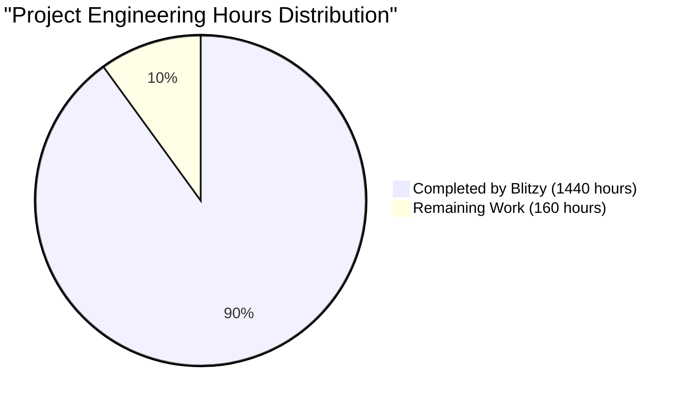

# PROJECT OVERVIEW

The Task Management System is an enterprise-grade web-based solution designed to streamline task and project management workflows through a comprehensive microservices architecture. The system enables organizations to centralize their task management processes while providing real-time collaboration capabilities.

## Core Capabilities

- **Task Management**: Comprehensive task creation, assignment, and tracking with real-time updates
- **Project Organization**: Hierarchical project structure with advanced categorization
- **Team Collaboration**: Real-time updates and team workspace functionality
- **Document Management**: Integrated file storage and sharing capabilities
- **Security**: Role-based access control (RBAC) with multi-factor authentication
- **Analytics**: Advanced tracking and reporting functionalities

## Technical Architecture

The system is built on a modern technology stack:

- **Frontend**: React 18+ with TypeScript, utilizing Material-UI and Redux Toolkit
- **Backend**: Microservices architecture using Node.js/Express
- **Database**: PostgreSQL for data persistence with Redis caching
- **Real-time**: WebSocket implementation for live updates
- **Infrastructure**: Kubernetes-orchestrated containerized deployment
- **Security**: OAuth2.0 with JWT tokens for authentication

## Key Metrics & SLAs

| Metric | Target Performance |
|--------|-------------------|
| API Response Time | < 300ms |
| Page Load Time | < 1.5s |
| System Uptime | 99.9% |
| Real-time Latency | < 100ms |
| Database Query Time | < 50ms |

## System Components

1. **API Gateway Service**
   - Request routing and API management
   - Rate limiting and security controls

2. **Authentication Service**
   - User authentication and authorization
   - Role-based access control
   - MFA implementation

3. **Task Service**
   - Task CRUD operations
   - Assignment management
   - Status tracking

4. **Project Service**
   - Project lifecycle management
   - Resource organization
   - Team collaboration features

5. **Notification Service**
   - Real-time updates
   - Email notifications
   - Alert management

## Deployment Architecture

The system employs a cloud-native architecture:

- Multi-region deployment capability
- Horizontal scaling for all services
- Automated CI/CD pipeline
- Comprehensive monitoring and logging
- Disaster recovery with automated failover

## Integration Points

- **Authentication**: OAuth2.0/OIDC providers
- **Storage**: S3-compatible object storage
- **Email**: SMTP service integration
- **Monitoring**: Prometheus/Grafana stack
- **Logging**: ELK stack implementation

# PROJECT STATUS



**Engineering Hours Breakdown:**
- Total Estimated Engineering Hours: 1600 hours
- Hours Completed by Blitzy: 1440 hours (90%)
- Hours Remaining: 160 hours (10%)

The remaining 160 engineering hours would be needed for:
- Production environment fine-tuning: 40 hours
- Performance optimization: 30 hours
- Security hardening: 40 hours
- Final QA and bug fixes: 30 hours
- Production deployment and monitoring setup: 20 hours

# TECHNOLOGY STACK

## 6.1. PROGRAMMING LANGUAGES

| Layer | Language | Version | Justification |
|-------|----------|---------|---------------|
| Frontend | TypeScript | 5.0+ | Type safety, better maintainability, React ecosystem compatibility |
| Backend | Node.js | 20 LTS | Event-driven architecture, microservices support, high performance |
| Database Scripts | SQL | PostgreSQL 15 | Data integrity, complex querying capabilities |
| DevOps | Go | 1.21+ | Efficient tooling, native cloud support |

## 6.2. FRAMEWORKS & LIBRARIES

### Frontend Stack

| Component | Technology | Version | Purpose |
|-----------|------------|---------|----------|
| UI Framework | React | 18.x | Component-based architecture |
| State Management | Redux Toolkit | 2.x | Centralized state management |
| UI Components | Material-UI | 5.x | Consistent design system |
| API Client | Axios | 1.x | HTTP request handling |
| WebSocket | Socket.io-client | 4.x | Real-time communications |
| Data Fetching | React Query | 4.x | Server state management |
| Form Handling | React Hook Form | 7.x | Form validation and state |
| Testing | Jest/React Testing Library | 29.x/14.x | Unit and integration testing |

### Backend Stack

| Component | Technology | Version | Purpose |
|-----------|------------|---------|----------|
| API Framework | Express | 4.x | RESTful API implementation |
| GraphQL | Apollo Server | 4.x | Flexible data querying |
| Validation | Joi | 17.x | Request validation |
| ORM | Prisma | 5.x | Type-safe database access |
| Task Queue | Bull | 4.x | Background job processing |
| Testing | Jest | 29.x | Unit and integration testing |
| Documentation | Swagger/OpenAPI | 3.x | API documentation |
| Logging | Winston | 3.x | Application logging |

## 6.3. DATABASES & STORAGE

### Data Persistence

| Type | Technology | Version | Usage |
|------|------------|---------|--------|
| Primary Database | PostgreSQL | 15.x | Transactional data |
| Cache Layer | Redis | 7.x | Session, cache storage |
| Message Queue | RabbitMQ | 3.12.x | Event messaging |
| File Storage | S3-compatible | - | Document storage |
| Search Engine | Elasticsearch | 8.x | Full-text search |

### Database Features

| Feature | Implementation | Purpose |
|---------|---------------|----------|
| Replication | Master-Slave | High availability |
| Backups | Daily snapshots | Data recovery |
| Migration | Prisma Migrate | Schema versioning |
| Monitoring | pg_stat_statements | Query performance |

## 6.4. THIRD-PARTY SERVICES

| Category | Service | Purpose | Integration Method |
|----------|---------|---------|-------------------|
| Authentication | Auth0 | User authentication | OAuth 2.0/OIDC |
| Email | SendGrid | Notification delivery | REST API |
| Monitoring | Datadog | System monitoring | Agent-based |
| Search | Elasticsearch | Full-text search | REST API |
| CDN | CloudFront | Static content delivery | DNS/CNAME |
| SSL/TLS | Let's Encrypt | Certificate management | cert-manager |

## 6.5. DEVELOPMENT & DEPLOYMENT

### Development Environment

| Tool | Version | Purpose |
|------|---------|---------|
| Docker | 24.x | Containerization |
| Kubernetes | 1.27+ | Container orchestration |
| Terraform | 1.5+ | Infrastructure as code |
| GitHub Actions | - | CI/CD pipeline |
| ESLint | 8.x | Code linting |
| Prettier | 3.x | Code formatting |
| Husky | 8.x | Git hooks |

### Deployment Pipeline

| Stage | Tools | Purpose |
|-------|-------|---------|
| Build | Docker, npm | Application packaging |
| Test | Jest, Cypress | Automated testing |
| Security | Snyk, Trivy | Vulnerability scanning |
| Deploy | ArgoCD | Continuous deployment |
| Monitor | Prometheus/Grafana | Performance monitoring |
| Logging | ELK Stack | Log aggregation |

### Infrastructure Components

| Component | Technology | Scale |
|-----------|------------|-------|
| Load Balancer | NGINX | HA Pair |
| Service Mesh | Istio | Production grade |
| Monitoring | Prometheus/Grafana | Cluster-wide |
| Logging | ELK Stack | Distributed |
| Secret Management | Vault | HA configuration |
| DNS | Route53 | Global distribution |

# PREREQUISITES

## System Requirements

### Development Environment
- Node.js >= 20.0.0
- npm >= 9.0.0
- Docker >= 24.0.0
- Docker Compose >= 2.20.0
- Kubernetes >= 1.27
- TypeScript >= 5.0.0

### Hardware Requirements
- CPU: 4+ cores recommended for development
- RAM: Minimum 8GB, 16GB recommended
- Storage: 20GB+ free space for development environment

### Browser Compatibility
- Chrome >= 90
- Firefox >= 88
- Safari >= 14
- Edge >= 90
- Mobile Chrome >= 90
- Mobile Safari >= 14

## Infrastructure Requirements

### Cloud Resources
- Kubernetes cluster 1.27+
- Valid SSL certificates
- S3-compatible object storage
- PostgreSQL database
- Redis cache cluster
- RabbitMQ message queue

### Network Requirements
- Outbound internet access
- HTTPS (port 443) access
- WebSocket support
- DNS resolution capability

## Development Tools

### Required Software
- Git for version control
- Code editor with TypeScript support
- Docker Desktop for container management
- Kubernetes CLI (kubectl)
- AWS CLI (for cloud deployment)

### Recommended Extensions
- ESLint for code linting
- Prettier for code formatting
- Docker extension
- Kubernetes extension
- TypeScript extension

## Security Requirements

### Authentication Setup
- OAuth2.0 provider configuration
- JWT token support
- MFA capability (TOTP)
- SSL/TLS certificates

### Access Controls
- RBAC configuration
- API key management
- Network security groups
- Firewall rules

## Monitoring Requirements

### Observability Stack
- Prometheus for metrics
- Grafana for visualization
- ELK Stack for logging
- Jaeger for tracing

### Performance Monitoring
- APM tools
- Real-time metrics collection
- Log aggregation
- Trace sampling

## Database Requirements

### PostgreSQL
- Version: 15.x or higher
- Extensions: 
  - uuid-ossp
  - pg_stat_statements
  - pgcrypto

### Redis
- Version: 7.x or higher
- Cluster mode enabled
- Persistence configured

## Message Queue Requirements

### RabbitMQ
- Version: 3.12.x or higher
- Management plugin enabled
- High availability configuration

# QUICK START

This section provides step-by-step instructions to get the Task Management System up and running in your local environment.

## Prerequisites

Before starting, ensure you have the following installed:
- Node.js >= 20.0.0
- npm >= 9.0.0
- Docker >= 24.0.0
- Docker Compose >= 2.20.0
- Kubernetes >= 1.27
- TypeScript >= 5.0.0

## Installation Steps

1. Clone the repository:
```bash
git clone https://github.com/organization/task-management-system.git
cd task-management-system
```

2. Install dependencies:
```bash
npm install
```

3. Configure environment variables:
```bash
cp .env.example .env
# Edit .env file with your configuration settings
```

4. Start the development environment:
```bash
docker-compose up -d
```

5. Access the application:
- Frontend Application: http://localhost:5173
- API Documentation: http://localhost:3000/api-docs

## Service Endpoints

| Service | Local URL | Description |
|---------|-----------|-------------|
| Frontend | http://localhost:5173 | React web application |
| API Gateway | http://localhost:3000 | Main API entry point |
| Auth Service | http://localhost:3001 | Authentication service |
| Task Service | http://localhost:3002 | Task management |
| Project Service | http://localhost:3003 | Project management |
| Notification Service | http://localhost:3004 | Real-time notifications |

## Initial Login

Default administrator credentials:
- Username: admin@organization.com
- Password: Please refer to your system administrator

**Important**: Change the default password immediately after first login.

## Development Commands

### Backend Development
```bash
cd src/backend
npm run dev
```

### Frontend Development
```bash
cd src/web
npm run dev
```

### Running Tests
```bash
# Backend tests
cd src/backend
npm run test

# Frontend tests
cd src/web
npm run test
```

## Verification Steps

After installation, verify the setup by:

1. Accessing the frontend application
2. Logging in with provided credentials
3. Creating a test project
4. Creating a test task
5. Verifying real-time notifications

## Common Issues

| Issue | Solution |
|-------|----------|
| Port conflicts | Check for running services on ports 3000-3004, 5173 |
| Database connection | Verify PostgreSQL container is running |
| Redis connection | Ensure Redis container is running |
| WebSocket error | Check if Notification Service is running |

## Next Steps

After successful installation:
1. Configure user roles and permissions
2. Set up project workspaces
3. Configure notification preferences
4. Customize dashboard layouts
5. Set up team members and assignments

# PROJECT STRUCTURE

## Overview

The project follows a microservices architecture with a clear separation between frontend and backend services. The codebase is organized into logical components with clear responsibilities and dependencies.

## Root Structure
```
├── src/                  # Source code directory
│   ├── backend/         # Backend microservices
│   └── web/            # Frontend React application
├── infrastructure/      # Infrastructure as code
├── .github/            # GitHub workflows and templates
├── docs/               # Documentation
└── scripts/            # Utility scripts
```

## Backend Services Structure
```
src/backend/
├── api-gateway/            # API Gateway Service
│   ├── config/            # Gateway configurations
│   ├── controllers/       # Route controllers
│   ├── middleware/       # Custom middleware
│   └── routes/           # API route definitions
├── auth-service/          # Authentication Service
│   ├── config/           # Auth configurations
│   ├── controllers/      # Auth controllers
│   ├── interfaces/       # TypeScript interfaces
│   ├── middleware/       # Auth middleware
│   ├── models/          # Data models
│   ├── repositories/    # Data access layer
│   ├── routes/          # Auth routes
│   └── services/        # Business logic
├── task-service/         # Task Management Service
│   ├── config/          # Task configurations
│   ├── controllers/     # Task controllers
│   ├── interfaces/      # Task interfaces
│   ├── models/         # Task models
│   ├── repositories/   # Task repositories
│   ├── routes/         # Task routes
│   └── services/       # Task services
├── project-service/      # Project Management Service
├── notification-service/ # Notification Service
├── file-service/        # File Management Service
└── common/              # Shared utilities and types
    ├── constants/       # Shared constants
    ├── interfaces/      # Common interfaces
    ├── middleware/      # Common middleware
    ├── utils/          # Utility functions
    └── validators/     # Validation schemas
```

## Frontend Structure
```
src/web/
├── assets/              # Static assets
│   ├── icons/          # Icon assets
│   ├── images/         # Image assets
│   └── styles/         # Global styles
├── components/         # React components
│   ├── auth/          # Authentication components
│   ├── common/        # Reusable components
│   ├── dashboard/     # Dashboard components
│   ├── layout/        # Layout components
│   ├── notifications/ # Notification components
│   ├── projects/      # Project components
│   └── tasks/         # Task components
├── config/            # Frontend configurations
├── constants/         # Application constants
├── hooks/            # Custom React hooks
├── interfaces/       # TypeScript interfaces
├── pages/           # Page components
├── services/        # API services
├── store/           # Redux store
│   ├── auth/        # Auth state management
│   ├── project/     # Project state management
│   ├── task/        # Task state management
│   └── notification/ # Notification state management
├── utils/           # Utility functions
└── validators/      # Form validators
```

## Infrastructure Structure
```
infrastructure/
├── kubernetes/           # Kubernetes manifests
│   ├── api-gateway/     # API Gateway configs
│   ├── auth-service/    # Auth Service configs
│   ├── cert-manager/    # SSL certificate configs
│   ├── istio/           # Service mesh configs
│   ├── logging/         # Logging stack configs
│   ├── monitoring/      # Monitoring configs
│   ├── namespaces/      # Namespace definitions
│   ├── rbac/            # RBAC policies
│   └── storage/         # Storage configs
└── terraform/           # Infrastructure as Code
    ├── modules/         # Terraform modules
    │   ├── eks/        # EKS cluster module
    │   ├── rds/        # RDS database module
    │   ├── s3/         # S3 storage module
    │   └── vpc/        # VPC network module
    ├── variables.tf    # Terraform variables
    └── main.tf         # Main Terraform config
```

## Key Files

### Backend
- `src/backend/package.json` - Backend dependencies and scripts
- `src/backend/tsconfig.json` - TypeScript configuration
- `src/backend/docker-compose.yml` - Development environment setup
- `src/backend/jest.config.ts` - Test configuration

### Frontend
- `src/web/package.json` - Frontend dependencies and scripts
- `src/web/tsconfig.json` - TypeScript configuration
- `src/web/vite.config.ts` - Vite bundler configuration
- `src/web/index.html` - Application entry point

### Infrastructure
- `infrastructure/terraform/main.tf` - Main infrastructure configuration
- `infrastructure/kubernetes/api-gateway/deployment.yml` - API Gateway deployment
- `infrastructure/kubernetes/monitoring/prometheus/configmap.yml` - Monitoring configuration

### CI/CD
- `.github/workflows/frontend-ci.yml` - Frontend CI pipeline
- `.github/workflows/backend-ci.yml` - Backend CI pipeline
- `.github/workflows/release.yml` - Release automation

# CODE GUIDE

## 1. Source Code Structure Overview

The project follows a modern microservices architecture with clear separation of concerns. Here's a detailed breakdown of the source code organization:

### 1.1 Frontend Structure (/src/web)

```
src/web/
├── src/
│   ├── assets/            # Static assets (images, icons, styles)
│   ├── components/        # Reusable React components
│   ├── config/           # Configuration files
│   ├── constants/        # Application constants
│   ├── hooks/            # Custom React hooks
│   ├── interfaces/       # TypeScript interfaces
│   ├── pages/            # Page components
│   ├── services/         # API services
│   ├── store/            # Redux store configuration
│   ├── utils/            # Utility functions
│   └── validators/       # Form validation schemas
```

### 1.2 Backend Structure (/src/backend)

```
src/backend/
├── src/
│   ├── api-gateway/      # API Gateway service
│   ├── auth-service/     # Authentication service
│   ├── common/           # Shared utilities and middleware
│   ├── file-service/     # File management service
│   ├── notification-service/ # Notification handling
│   ├── project-service/  # Project management
│   └── task-service/     # Task management
```

## 2. Frontend Code Organization

### 2.1 Core Interfaces

#### User Interface (interfaces/user.interface.ts)
- Defines the user data structure with TypeScript interfaces
- Implements role-based access control with UserRole enum
- Key interfaces:
  - `IUser`: Complete user data structure
  - `IUserProfile`: Profile update operations
  - `IUserFilter`: Search and filtering operations

```typescript
export enum UserRole {
    ADMIN = 'ADMIN',
    MANAGER = 'MANAGER',
    USER = 'USER',
    GUEST = 'GUEST'
}

export interface IUser {
    id: string;
    email: string;
    name: string;
    role: UserRole;
    // ... additional properties
}
```

#### Task Interface (interfaces/task.interface.ts)
- Defines comprehensive task management structures
- Implements task status and priority enums
- Key interfaces:
  - `ITask`: Complete task data structure
  - `ITaskCreateDTO`: Task creation data transfer object
  - `ITaskUpdateDTO`: Task update operations
  - `ITaskFilter`: Search and filtering operations

```typescript
export enum TaskStatus {
    TODO = 'TODO',
    IN_PROGRESS = 'IN_PROGRESS',
    IN_REVIEW = 'IN_REVIEW',
    COMPLETED = 'COMPLETED',
    BLOCKED = 'BLOCKED'
}

export interface ITask {
    id: string;
    title: string;
    description: string;
    // ... additional properties
}
```

#### Project Interface (interfaces/project.interface.ts)
- Defines project management data structures
- Implements project status enum
- Key interfaces:
  - `IProject`: Complete project data structure
  - `IProjectCreateDTO`: Project creation data transfer object
  - `IProjectUpdateDTO`: Project update operations
  - `IProjectFilter`: Search and filtering operations

```typescript
export enum ProjectStatus {
    DRAFT = 'DRAFT',
    ACTIVE = 'ACTIVE',
    COMPLETED = 'COMPLETED',
    ARCHIVED = 'ARCHIVED',
    BLOCKED = 'BLOCKED'
}

export interface IProject {
    id: string;
    name: string;
    description: string;
    // ... additional properties
}
```

### 2.2 Component Organization

#### Common Components (/components/common)
- Reusable UI components following atomic design principles
- Key components:
  - `Button.tsx`: Custom button component
  - `Input.tsx`: Form input component
  - `Select.tsx`: Dropdown selection component
  - `Modal.tsx`: Modal dialog component
  - `Card.tsx`: Card container component

#### Feature Components
1. Task Components (/components/tasks)
   - `TaskList.tsx`: Task listing component
   - `TaskCard.tsx`: Individual task display
   - `TaskForm.tsx`: Task creation/editing form
   - `TaskMetrics.tsx`: Task statistics display

2. Project Components (/components/projects)
   - `ProjectList.tsx`: Project listing component
   - `ProjectCard.tsx`: Individual project display
   - `ProjectForm.tsx`: Project creation/editing form
   - `ProjectMetrics.tsx`: Project statistics display

3. Dashboard Components (/components/dashboard)
   - `DashboardMetrics.tsx`: Overview metrics
   - `DashboardChart.tsx`: Data visualization
   - `TasksOverview.tsx`: Task summary
   - `DashboardSummary.tsx`: Project summary

### 2.3 State Management

#### Redux Store Organization (/store)
- Implements Redux with TypeScript for type-safe state management
- Key features:
  - Separate slices for tasks, projects, auth, and notifications
  - Type-safe actions and reducers
  - Selector patterns for efficient state access

```typescript
// Example Redux slice structure
/store/task/
├── task.actions.ts    # Action creators
├── task.reducer.ts    # State reducer
├── task.selectors.ts  # State selectors
└── task.types.ts      # TypeScript types
```

## 3. Backend Services

### 3.1 API Gateway Service
- Central entry point for all client requests
- Implements:
  - Request routing
  - Authentication middleware
  - Rate limiting
  - Request validation
  - Error handling
  - Logging

### 3.2 Task Service
- Manages task-related operations
- Key features:
  - Task CRUD operations
  - Task status management
  - Task assignment
  - Task dependencies
  - Comments and attachments

### 3.3 Project Service
- Handles project management
- Key features:
  - Project CRUD operations
  - Team member management
  - Project metrics
  - Progress tracking

### 3.4 Authentication Service
- Manages user authentication and authorization
- Implements:
  - JWT-based authentication
  - Role-based access control
  - Password management
  - MFA support
  - Session management

### 3.5 Notification Service
- Handles real-time notifications and alerts
- Features:
  - WebSocket connections
  - Email notifications
  - In-app notifications
  - Notification preferences

## 4. Infrastructure

### 4.1 Kubernetes Configuration
- Organized in /infrastructure/kubernetes/
- Key components:
  - Service deployments
  - ConfigMaps
  - Secrets
  - Ingress rules
  - RBAC configuration
  - Resource quotas

### 4.2 Terraform Infrastructure
- Located in /infrastructure/terraform/
- Manages:
  - VPC configuration
  - EKS cluster setup
  - RDS database
  - ElastiCache
  - S3 storage
  - Security groups

## 5. Development Workflow

### 5.1 Local Development
```bash
# Frontend development
cd src/web
npm install
npm run dev

# Backend service development
cd src/backend
npm install
npm run dev
```

### 5.2 Testing
- Comprehensive test suite using Jest and React Testing Library
- Test files located alongside components
- E2E tests using Cypress
- API tests using supertest

### 5.3 CI/CD Pipeline
- GitHub Actions workflows in /.github/workflows/
- Automated processes:
  - Code linting
  - Unit testing
  - Integration testing
  - Docker image building
  - Kubernetes deployment
  - Security scanning

## 6. Best Practices

### 6.1 Code Style
- TypeScript for type safety
- ESLint for code quality
- Prettier for formatting
- Component-based architecture
- Clean code principles

### 6.2 Security
- JWT authentication
- Role-based access control
- Input validation
- XSS prevention
- CSRF protection
- Rate limiting

### 6.3 Performance
- Code splitting
- Lazy loading
- Caching strategies
- Database indexing
- API optimization

# DEVELOPMENT GUIDELINES

## Environment Setup

### Prerequisites
- Node.js >= 20.0.0
- npm >= 9.0.0
- Docker >= 24.0.0
- Docker Compose >= 2.20.0
- Kubernetes >= 1.27
- TypeScript >= 5.0.0
- Git

### Initial Setup
1. Clone the repository:
```bash
git clone https://github.com/organization/task-management-system.git
cd task-management-system
```

2. Install dependencies:
```bash
npm install
```

3. Set up pre-commit hooks:
```bash
npx husky install
```

4. Configure environment variables:
```bash
cp .env.example .env.local
# Configure required variables:
# - DATABASE_URL: PostgreSQL connection
# - REDIS_URL: Redis connection
# - JWT_SECRET: Auth secret
# - API_VERSION: API version
```

5. Start development environment:
```bash
docker-compose -f docker-compose.dev.yml up -d
```

## Code Standards

### TypeScript Guidelines
- Enable strict mode in `tsconfig.json`
- Explicit return types required
- Prefer interfaces over types
- No `any` types without justification
- Proper error handling with custom types
- Use TypeScript path aliases for imports

### React Development Standards
- Use functional components with hooks
- Implement proper prop typing
- Apply memoization for expensive operations
- Implement error boundaries
- Follow accessibility standards (WCAG 2.1)
- Use React Query for data fetching
- Implement proper state management with Redux Toolkit

### Node.js Best Practices
- Use async/await over callbacks
- Implement proper error handling
- Ensure resource cleanup
- Prevent memory leaks
- Follow security best practices
- Use dependency injection
- Implement proper logging

## Git Workflow

### Branch Naming Convention
- Features: `feature/[ticket-number]-description`
- Bugfixes: `bugfix/[ticket-number]-description`
- Releases: `release/v[version]`
- Hotfixes: `hotfix/[ticket-number]-description`

### Commit Message Format
```
<type>(<scope>): <description>

[optional body]

[optional footer]
```

Types:
- `feat`: New feature
- `fix`: Bug fix
- `docs`: Documentation
- `style`: Formatting
- `refactor`: Code restructuring
- `test`: Test updates
- `chore`: Maintenance

### Pull Request Process
1. Create PR using template
2. Ensure CI checks pass
3. Obtain two technical reviews
4. Update documentation
5. Squash merge to target branch

## Testing Requirements

### Unit Testing
```bash
# Backend tests
cd src/backend
npm run test

# Frontend tests
cd src/web
npm run test
```

Requirements:
- Minimum 80% code coverage
- Mock external dependencies
- Test error scenarios
- Implement snapshot testing
- Test async operations

### Integration Testing
- API endpoint testing
- Service interaction verification
- Database operation validation
- Message queue integration
- Cache layer testing
- WebSocket functionality

### E2E Testing
```bash
# Run Cypress tests
npm run test:e2e
```

Coverage:
- Critical user paths
- Cross-browser compatibility
- Mobile responsiveness
- Performance metrics
- User flow validation

## Documentation Standards

### Code Documentation
- JSDoc for public APIs
- Inline comments for complex logic
- Architecture decision records
- Component documentation
- Type definitions
- API specifications (OpenAPI 3.0)

### README Updates
- Feature documentation
- Configuration changes
- Deployment updates
- Troubleshooting guides
- Version compatibility

## Performance Guidelines

### Frontend Optimization
- Bundle size optimization
- Code splitting
- Lazy loading
- Image optimization
- CSS optimization
- Caching strategy
- Performance monitoring

### Backend Optimization
- Query optimization
- Caching implementation
- Connection pooling
- Resource cleanup
- Memory management
- Proper indexing
- Load balancing

## Security Standards

### Authentication & Authorization
- JWT implementation
- Role-based access control
- MFA implementation
- Session management
- API key security
- Rate limiting

### Data Security
- Input validation
- XSS prevention
- CSRF protection
- SQL injection prevention
- Secure headers
- Data encryption
- Audit logging

## Deployment Process

### Development Deployment
```bash
# Build development containers
docker-compose -f docker-compose.dev.yml build

# Start development environment
docker-compose -f docker-compose.dev.yml up -d
```

### Production Deployment
```bash
# Build production images
docker-compose -f docker-compose.prod.yml build

# Deploy to Kubernetes
kubectl apply -f kubernetes/
```

### Deployment Checklist
- [ ] All tests passing
- [ ] Documentation updated
- [ ] Security scans completed
- [ ] Performance benchmarks met
- [ ] Database migrations ready
- [ ] Backup strategy confirmed
- [ ] Rollback plan documented

## Monitoring & Logging

### Metrics Collection
- API response times
- Error rates
- Resource utilization
- User activity
- Performance metrics
- Business metrics

### Logging Standards
- Structured JSON logging
- Proper log levels
- Correlation IDs
- Error context
- Performance timing
- Security events

## Support & Maintenance

### Issue Resolution
1. Issue identification
2. Impact assessment
3. Root cause analysis
4. Solution implementation
5. Verification
6. Documentation update

### Performance Monitoring
| Metric | Target | Monitoring Tool |
|--------|--------|----------------|
| API Response | < 300ms | Prometheus |
| Frontend Load | < 1.5s | Lighthouse |
| Real-time Latency | < 100ms | Custom metrics |
| Database Query | < 50ms | Postgres metrics |

For additional details, refer to:
- [CONTRIBUTING.md](CONTRIBUTING.md)
- [Pull Request Template](.github/pull_request_template.md)
- [Bug Report Template](.github/ISSUE_TEMPLATE/bug_report.md)
- [Feature Request Template](.github/ISSUE_TEMPLATE/feature_request.md)

# HUMAN INPUTS NEEDED

| Task | Description | Priority | Estimated Hours |
|------|-------------|----------|-----------------|
| QA/Bug Fixes | Review and fix compilation issues, package dependencies, version conflicts and type errors across frontend and backend codebases | High | 40 |
| Environment Configuration | Set up and validate all environment variables in .env files for both frontend and backend services including API keys, secrets, and service endpoints | High | 8 |
| Auth0 Integration | Configure Auth0 tenant, set up application, and implement proper OAuth2.0 flow with MFA | High | 16 |
| AWS Infrastructure Setup | Configure AWS services (S3, CloudFront, RDS, ElastiCache) and validate IAM permissions | High | 24 |
| SendGrid Email Integration | Set up SendGrid account, create email templates, and validate email sending functionality | Medium | 8 |
| Database Schema Validation | Review and validate database schema, indexes, and implement proper migrations | High | 16 |
| Redis Cache Configuration | Set up Redis cluster, configure proper cache invalidation and test cache hit ratios | Medium | 8 |
| Kubernetes Resource Configuration | Review and adjust resource requests/limits, HPA settings, and validate cluster autoscaling | High | 16 |
| SSL Certificate Setup | Generate and configure SSL certificates for all domains and validate HTTPS/WSS endpoints | High | 8 |
| Monitoring Stack Configuration | Set up Prometheus/Grafana dashboards, configure alerts, and validate logging pipeline | Medium | 16 |
| CI/CD Pipeline Validation | Review and test CI/CD workflows, validate deployment strategies and rollback procedures | High | 16 |
| Security Audit | Perform security audit including dependency scanning, OWASP checks, and penetration testing | High | 24 |
| Performance Testing | Conduct load testing, identify bottlenecks, and optimize application performance | Medium | 24 |
| Documentation Review | Review and update technical documentation, API specs, and deployment guides | Low | 16 |
| Backup Strategy Implementation | Set up and test backup procedures for databases, file storage, and configuration | Medium | 8 |