# Technical Specifications

# 1. INTRODUCTION

## 1.1. EXECUTIVE SUMMARY

The Task Management System is a comprehensive web-based solution designed to streamline task and project management workflows. 

| Business Problem | Solution Approach |
|-----------------|-------------------|
| Fragmented task management | Centralized platform for all task-related activities |
| Inefficient collaboration | Real-time updates and team workspace |
| Limited visibility into progress | Advanced tracking and reporting capabilities |
| Inconsistent access control | Role-based permission system |

**Key Stakeholders:**
- Project Managers and Team Leaders
- Team Members and Contributors
- System Administrators
- Department Heads
- External Collaborators

**Value Proposition:**
- 30% reduction in task management overhead
- Improved team productivity through streamlined workflows
- Enhanced visibility into project progress
- Reduced communication gaps and improved collaboration

## 1.2. SYSTEM OVERVIEW

### Project Context

| Aspect | Details |
|--------|----------|
| Market Position | Enterprise-grade task management solution |
| Target Market | Small to medium-sized teams and organizations |
| Integration Landscape | Compatible with existing enterprise tools and workflows |

### High-Level Description

**Primary Capabilities:**
- Task creation, assignment, and tracking
- Project organization and categorization
- Real-time collaboration and updates
- Document management and file sharing
- Reporting and analytics

**Key Architectural Components:**
- Web-based frontend application
- RESTful API backend
- Real-time notification system
- Document storage system
- Authentication and authorization service

### Success Criteria

| KPI Category | Metrics |
|--------------|---------|
| Performance | - Page load time < 2 seconds<br>- 99.9% system uptime |
| Adoption | - 80% user activation rate<br>- 70% weekly active users |
| Efficiency | - 25% reduction in task completion time<br>- 40% decrease in status update meetings |
| User Satisfaction | - User satisfaction score > 4.5/5<br>- Support ticket resolution < 24 hours |

## 1.3. SCOPE

### In-Scope Elements

**Core Features:**
- User authentication and authorization
- Task and project management
- Team collaboration tools
- File attachment and storage
- Reporting and analytics
- Real-time notifications
- Mobile-responsive interface

**Implementation Boundaries:**

| Boundary Type | Coverage |
|--------------|----------|
| User Groups | Internal teams, external collaborators, system administrators |
| Geographic | Global access with multi-language support |
| Data Domains | Project data, user data, task metadata, activity logs |
| Technical | Web browsers, mobile web, REST API access |

### Out-of-Scope Elements

- Native mobile applications
- Advanced business intelligence tools
- Custom workflow automation
- Third-party marketplace integration
- Legacy system data migration
- Offline mode functionality
- Video conferencing features
- Complex project portfolio management
- Financial management tools
- Resource capacity planning

# 2. PRODUCT REQUIREMENTS

## 2.1. FEATURE CATALOG

### Authentication & User Management

| Metadata | Details |
|----------|---------|
| ID | F-001 |
| Name | User Authentication System |
| Category | Security |
| Priority | Critical |
| Status | Approved |

**Description**
- Overview: Secure authentication system with role-based access control
- Business Value: Ensures data security and appropriate access levels
- User Benefits: Single sign-on, secure access, role-specific features
- Technical Context: OAuth2.0 implementation with JWT tokens

**Dependencies**
- Prerequisites: None
- System: User database, email service
- External: Identity provider integration
- Integration: SSO providers, email verification system

### Task Management Core

| Metadata | Details |
|----------|---------|
| ID | F-002 |
| Name | Task Creation and Management |
| Category | Core Functionality |
| Priority | Critical |
| Status | In Development |

**Description**
- Overview: Comprehensive task creation and management system
- Business Value: Centralized task tracking and organization
- User Benefits: Efficient task organization and tracking
- Technical Context: Real-time updates via WebSocket

**Dependencies**
- Prerequisites: F-001
- System: Database, file storage
- External: None
- Integration: Notification system

### Project Organization

| Metadata | Details |
|----------|---------|
| ID | F-003 |
| Name | Project Workspace |
| Category | Organization |
| Priority | High |
| Status | Proposed |

**Description**
- Overview: Project-level organization and categorization
- Business Value: Structured work management
- User Benefits: Better project oversight and organization
- Technical Context: Hierarchical data structure

**Dependencies**
- Prerequisites: F-002
- System: Database
- External: None
- Integration: Task management system

## 2.2. FUNCTIONAL REQUIREMENTS TABLE

### Authentication Requirements

| Requirement ID | Description | Priority | Complexity |
|---------------|-------------|-----------|------------|
| F-001-RQ-001 | User registration with email verification | Must-Have | Medium |
| F-001-RQ-002 | Role-based access control | Must-Have | High |
| F-001-RQ-003 | Password reset functionality | Must-Have | Low |

**Technical Specifications**
- Input: User credentials, role information
- Output: Authentication token, user session
- Performance: < 1s response time
- Data: User profiles, roles, permissions

**Validation Rules**
- Password complexity requirements
- Email format validation
- Role assignment rules
- Session timeout policies

### Task Management Requirements

| Requirement ID | Description | Priority | Complexity |
|---------------|-------------|-----------|------------|
| F-002-RQ-001 | Task creation with required fields | Must-Have | Medium |
| F-002-RQ-002 | Task assignment and reassignment | Must-Have | Low |
| F-002-RQ-003 | Task status updates and tracking | Must-Have | Medium |

**Technical Specifications**
- Input: Task details, assignments
- Output: Task records, notifications
- Performance: Real-time updates
- Data: Task metadata, history

**Validation Rules**
- Required field validation
- Status transition rules
- Assignment permissions
- Data integrity checks

## 2.3. FEATURE RELATIONSHIPS

### Dependency Matrix

| Feature | Depends On | Required By |
|---------|------------|-------------|
| F-001 | None | F-002, F-003 |
| F-002 | F-001 | F-003 |
| F-003 | F-001, F-002 | None |

### Integration Points

| Component | Integration Type | Connected Features |
|-----------|-----------------|-------------------|
| Authentication | Internal | F-001, F-002, F-003 |
| Notification | Internal | F-002, F-003 |
| File Storage | External | F-002 |

## 2.4. IMPLEMENTATION CONSIDERATIONS

### Technical Constraints

| Feature | Constraint Type | Description |
|---------|----------------|-------------|
| F-001 | Security | HTTPS required, token encryption |
| F-002 | Performance | Max 100 tasks per view |
| F-003 | Scalability | Max 1000 projects per organization |

### Performance Requirements

| Feature | Metric | Requirement |
|---------|--------|-------------|
| F-001 | Authentication Time | < 1 second |
| F-002 | Task Creation | < 2 seconds |
| F-003 | Project Load Time | < 3 seconds |

### Security Implications

| Feature | Security Requirement | Implementation |
|---------|---------------------|----------------|
| F-001 | Data Encryption | AES-256 |
| F-002 | Access Control | RBAC |
| F-003 | Audit Logging | Activity tracking |

# 3. PROCESS FLOWCHART

## 3.1. SYSTEM WORKFLOWS

### Core Business Processes

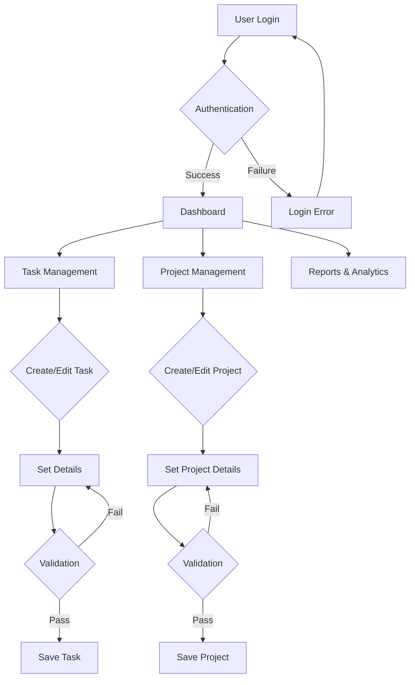

### Integration Workflows

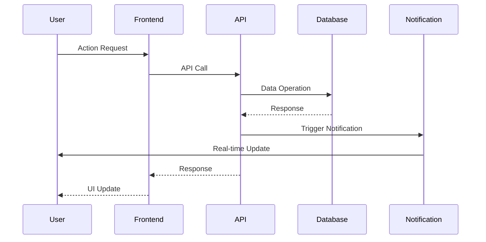

## 3.2. FLOWCHART REQUIREMENTS

### Task Creation Flow

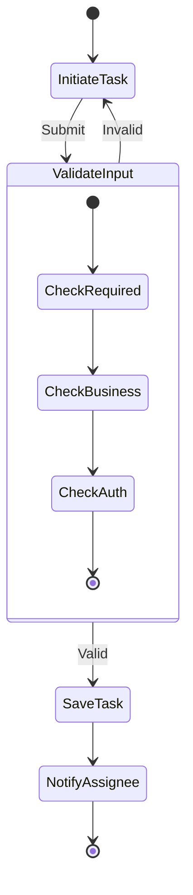

### Authorization Flow

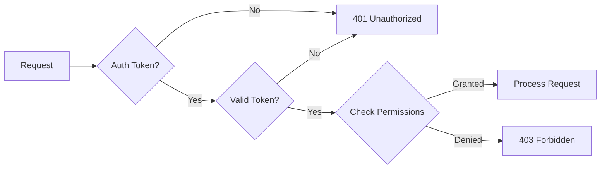

## 3.3. TECHNICAL IMPLEMENTATION

### State Management

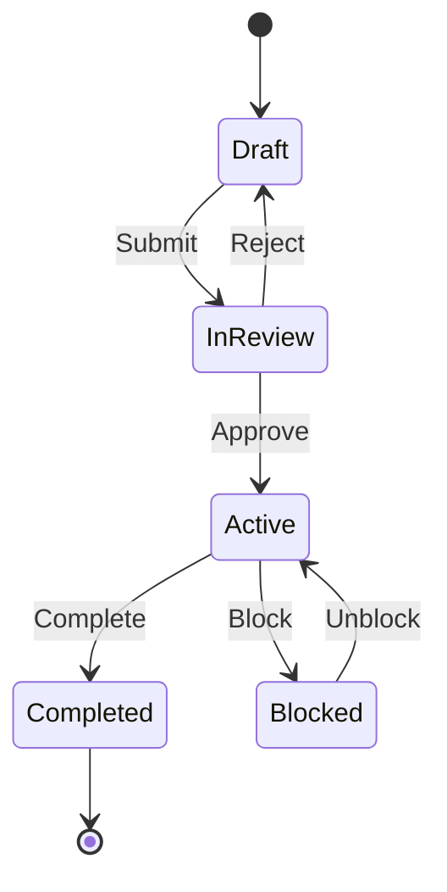

### Error Handling Flow

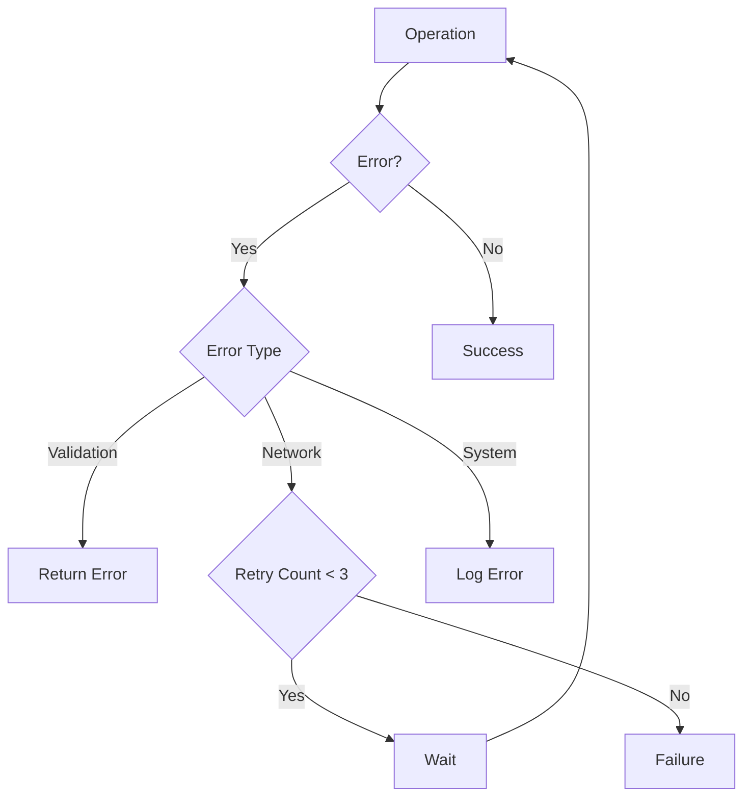

## 3.4. VALIDATION RULES

| Process Step | Validation Rules | Error Handling |
|-------------|------------------|----------------|
| Task Creation | - Required fields<br>- Date validation<br>- Assignment rules | Return validation errors |
| Project Setup | - Unique project code<br>- Valid timeline<br>- Resource allocation | Prompt for correction |
| User Actions | - Permission check<br>- Business rules<br>- Data integrity | Show error message |

## 3.5. TIMING CONSTRAINTS

| Process | SLA Target | Retry Policy |
|---------|------------|--------------|
| Authentication | < 1s | 3 attempts/minute |
| Task Operations | < 2s | 2 attempts |
| Project Updates | < 3s | 3 attempts |
| Report Generation | < 5s | No retry |

## 3.6. INTEGRATION SEQUENCE

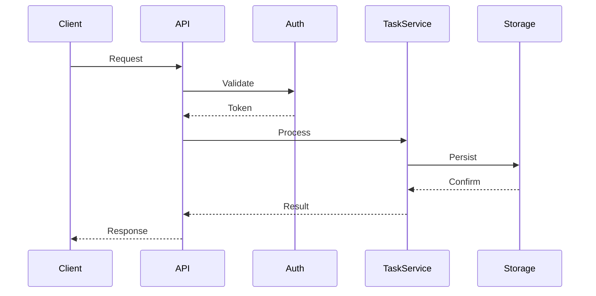

# 4. SYSTEM ARCHITECTURE

## 4.1. HIGH-LEVEL ARCHITECTURE

### System Context (C4 Level 0)

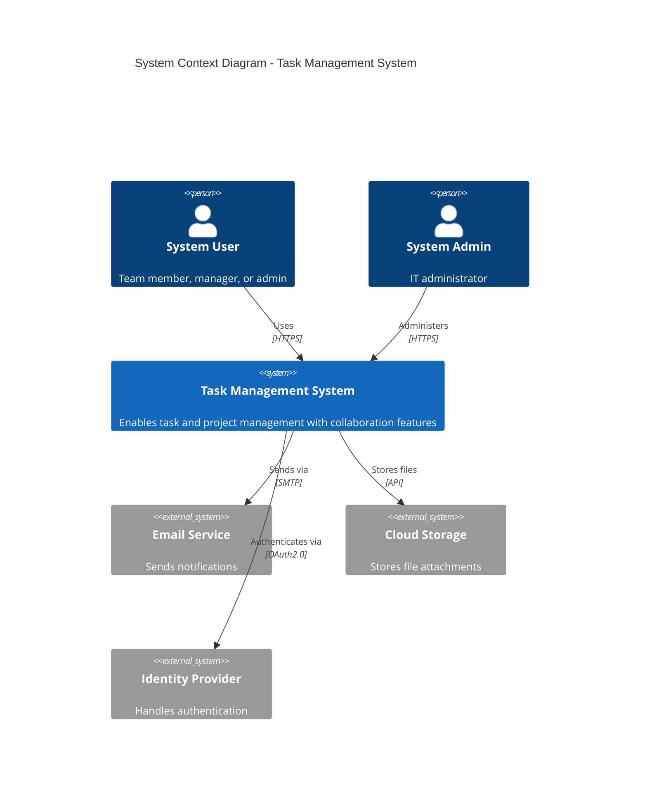

### Container Architecture (C4 Level 1)

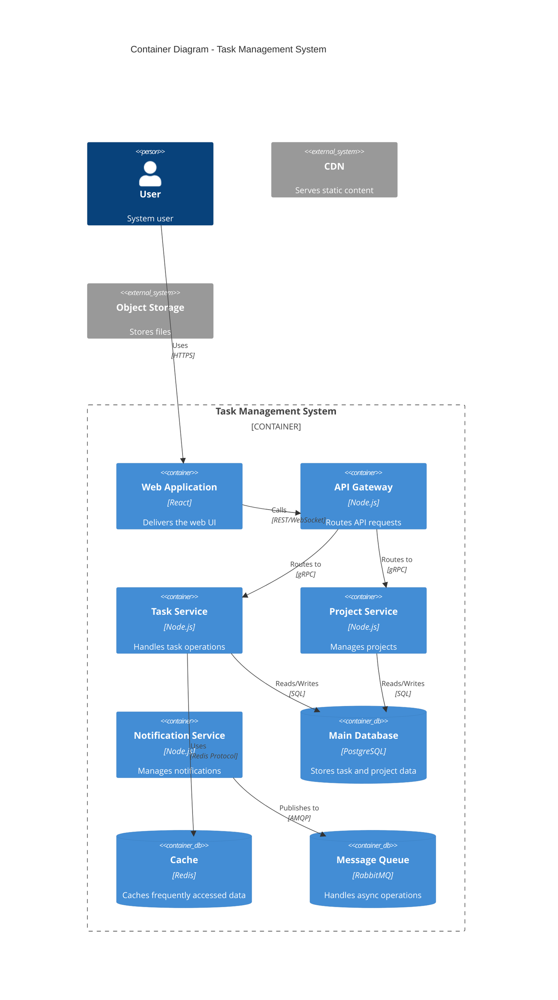

## 4.2. COMPONENT DETAILS

### Core Components

| Component | Purpose | Technology Stack | Scaling Strategy |
|-----------|---------|-----------------|------------------|
| Web Frontend | User interface | React, Redux, TypeScript | Horizontal scaling, CDN |
| API Gateway | Request routing | Node.js, Express | Load balanced, stateless |
| Task Service | Task management | Node.js, TypeScript | Horizontal scaling |
| Project Service | Project management | Node.js, TypeScript | Horizontal scaling |
| Notification Service | Alert handling | Node.js, WebSocket | Event-driven scaling |

### Data Stores

| Store Type | Technology | Purpose | Scaling Approach |
|------------|------------|---------|------------------|
| Main Database | PostgreSQL | Primary data store | Master-slave replication |
| Cache | Redis | Performance optimization | Redis cluster |
| Message Queue | RabbitMQ | Async communication | Clustered deployment |
| Object Storage | S3-compatible | File storage | Built-in scaling |

## 4.3. TECHNICAL DECISIONS

### Architecture Patterns

| Pattern | Implementation | Justification |
|---------|---------------|---------------|
| Microservices | Domain-based services | Scalability, maintainability |
| Event-driven | RabbitMQ | Async operations, decoupling |
| CQRS | Read/Write separation | Performance optimization |
| API Gateway | Centralized routing | Security, monitoring |

### Communication Patterns

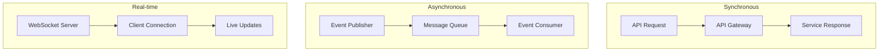

## 4.4. CROSS-CUTTING CONCERNS

### Monitoring Architecture

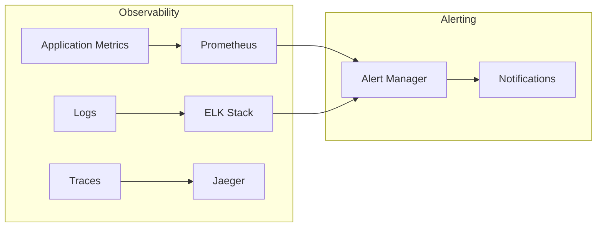

### Security Architecture

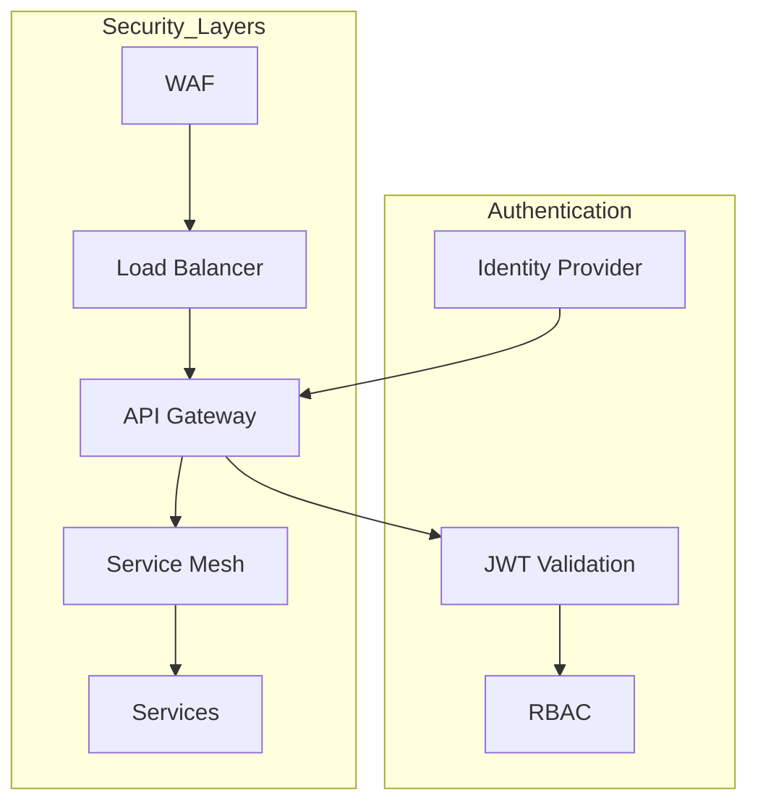

## 4.5. DEPLOYMENT ARCHITECTURE

```mermaid
C4Deployment
    title Deployment Diagram - Task Management System
    
    Deployment_Node(cdn, "CDN", "Content Delivery Network") {
        Container(static, "Static Assets", "Web content")
    }
    
    Deployment_Node(cloud, "Cloud Platform", "Production Environment") {
        Deployment_Node(dmz, "DMZ") {
            Container(lb, "Load Balancer", "nginx")
            Container(api_gateway, "API Gateway", "Node.js")
        }
        
        Deployment_Node(app, "Application Tier") {
            Container(services, "Microservices", "Node.js Containers")
        }
        
        Deployment_Node(data, "Data Tier") {
            ContainerDb(db_cluster, "Database Cluster", "PostgreSQL")
            ContainerDb(cache_cluster, "Cache Cluster", "Redis")
            ContainerDb(queue_cluster, "Message Queue", "RabbitMQ")
        }
    }
    
    Rel(cdn, lb, "Routes traffic", "HTTPS")
    Rel(lb, api_gateway, "Routes requests", "HTTP")
    Rel(api_gateway, services, "Routes to services", "gRPC")
    Rel(services, db_cluster, "Persists data", "SQL")
    Rel(services, cache_cluster, "Caches data", "Redis Protocol")
    Rel(services, queue_cluster, "Messages", "AMQP")
```

# 5. SYSTEM COMPONENTS DESIGN

## 5.1. CORE SERVICES ARCHITECTURE

### Service Components

| Service | Responsibility | Communication Pattern | Discovery Method |
|---------|---------------|----------------------|------------------|
| Task Service | Task CRUD, assignments | REST/gRPC | Kubernetes Service |
| Project Service | Project management | REST/gRPC | Kubernetes Service |
| User Service | User management | REST/gRPC | Kubernetes Service |
| Notification Service | Alert distribution | Event-driven | Message Queue |
| File Service | Document management | REST | Service Mesh |

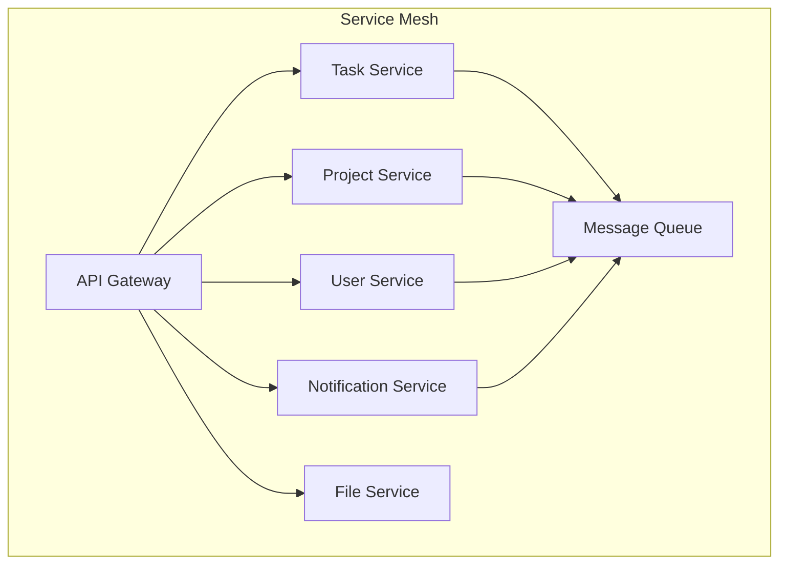

#### Circuit Breaker Configuration

| Service | Threshold | Timeout | Reset Time |
|---------|-----------|---------|------------|
| Task Service | 5 failures/10s | 2s | 30s |
| Project Service | 3 failures/10s | 3s | 30s |
| User Service | 3 failures/10s | 1s | 20s |
| File Service | 5 failures/10s | 5s | 60s |

### Scalability Design

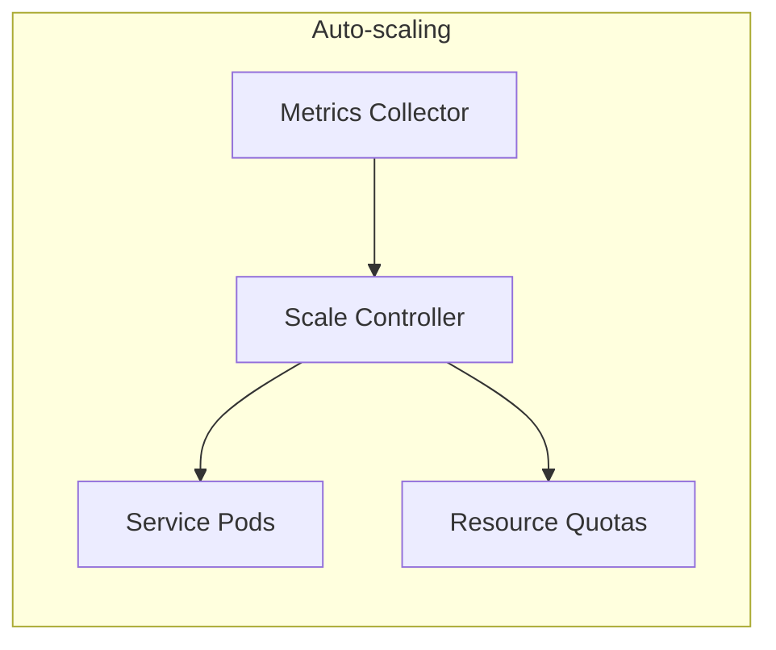

| Component | Scaling Strategy | Triggers | Resource Limits |
|-----------|-----------------|----------|-----------------|
| Task Service | Horizontal | CPU > 70%, Memory > 80% | 2-10 pods |
| Project Service | Horizontal | CPU > 70%, Memory > 80% | 2-8 pods |
| User Service | Horizontal | CPU > 60%, Memory > 75% | 2-6 pods |
| File Service | Horizontal | CPU > 75%, Storage > 85% | 2-8 pods |

### Resilience Patterns

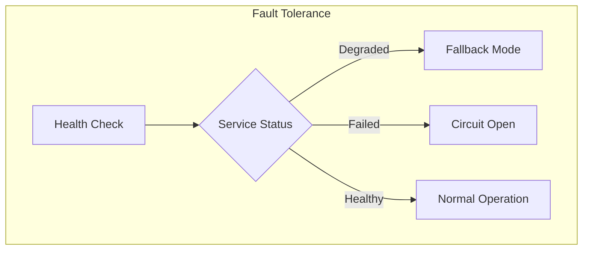

| Pattern | Implementation | Recovery Time | Data Protection |
|---------|---------------|---------------|-----------------|
| Circuit Breaker | Hystrix | 30s timeout | Local cache |
| Rate Limiting | Token bucket | N/A | Queue overflow |
| Bulkhead | Thread pools | Dynamic | Resource isolation |
| Fallback | Static responses | Immediate | Read-only mode |

## 5.2. DATABASE DESIGN

### Schema Design

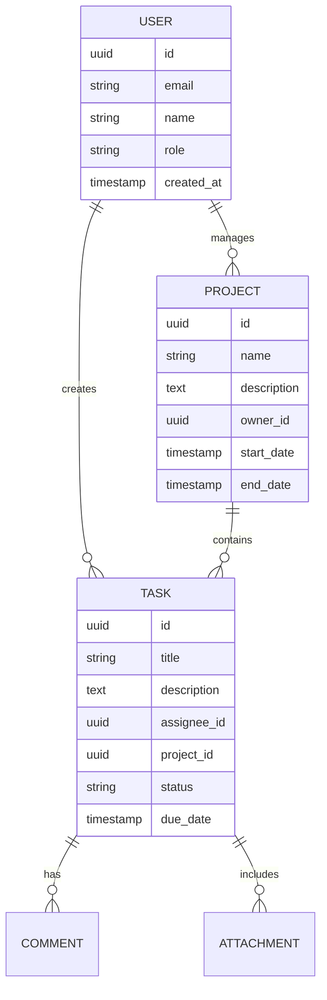

#### Indexing Strategy

| Table | Index Type | Columns | Purpose |
|-------|------------|---------|---------|
| Task | B-tree | (project_id, status) | Task filtering |
| Task | B-tree | (assignee_id, due_date) | Assignment queries |
| Project | B-tree | (owner_id, start_date) | Project listing |
| User | Hash | email | Login lookup |

### Data Management

| Aspect | Strategy | Implementation | Retention |
|--------|----------|----------------|-----------|
| Backups | Daily full, hourly incremental | pg_dump | 30 days |
| Archival | Monthly compression | S3 cold storage | 7 years |
| Versioning | Change tracking | Temporal tables | 90 days |
| Auditing | Event logging | Audit triggers | 1 year |

### Performance Optimization

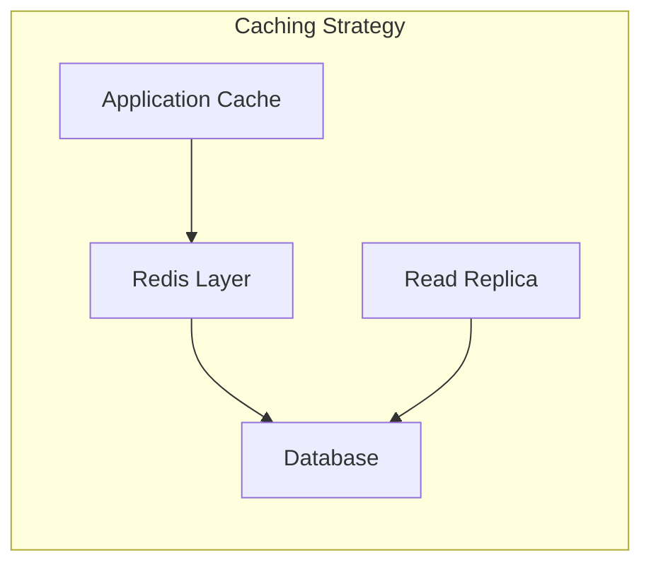

| Optimization | Implementation | Impact |
|--------------|----------------|---------|
| Query Cache | Redis | 50ms response |
| Connection Pool | PgBouncer | 200 connections |
| Read Replicas | Async replication | 3 replicas |
| Batch Processing | Bulk operations | 1000 records/batch |

## 5.3. INTEGRATION ARCHITECTURE

### API Design

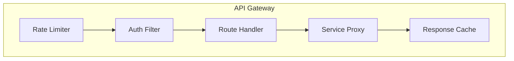

| Endpoint Type | Protocol | Auth Method | Rate Limit |
|--------------|----------|-------------|------------|
| Public API | REST/HTTPS | JWT | 100/min |
| Internal API | gRPC | mTLS | 1000/min |
| Webhook | HTTPS | HMAC | 50/min |
| WebSocket | WSS | Token | 5000/hour |

### Message Processing

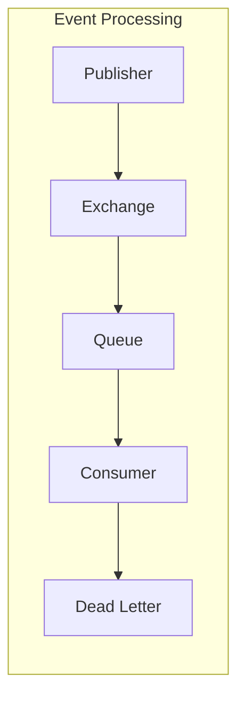

| Queue Type | Purpose | Retry Policy | TTL |
|------------|---------|--------------|-----|
| Task Updates | Real-time sync | 3 attempts | 1 hour |
| Notifications | Alert delivery | 5 attempts | 24 hours |
| Audit Events | Logging | No retry | 7 days |

## 5.4. SECURITY ARCHITECTURE

### Authentication Framework

```mermaid
flowchart TD
    subgraph Auth Flow
        A[Login Request] --> B{Valid Credentials}
        B -->|Yes| C[Generate JWT]
        B -->|No| D[Error Response]
        C --> E[Set Session]
        E --> F[Return Token]
    end
```

| Security Control | Implementation | Policy |
|-----------------|----------------|---------|
| Password Rules | Min 12 chars, complexity | 90-day rotation |
| MFA | TOTP-based | Required for admin |
| Session | JWT with refresh | 24-hour expiry |
| API Keys | HMAC-SHA256 | 90-day rotation |

### Authorization System

```mermaid
flowchart TD
    subgraph RBAC
        A[Request] --> B{Role Check}
        B -->|Authorized| C[Resource Access]
        B -->|Denied| D[Access Denied]
        C --> E[Audit Log]
    end
```

| Role | Permissions | Scope |
|------|------------|-------|
| Admin | Full access | Global |
| Manager | Write/Delete | Project |
| User | Read/Write | Assigned |
| Guest | Read | Public |

# 6. TECHNOLOGY STACK

## 6.1. PROGRAMMING LANGUAGES

| Layer | Language | Version | Justification |
|-------|----------|---------|---------------|
| Frontend | TypeScript | 5.0+ | Type safety, better maintainability, React ecosystem compatibility |
| Backend | Node.js | 20 LTS | Event-driven architecture, microservices support, high performance |
| Database Scripts | SQL | PostgreSQL 15 | Data integrity, complex querying capabilities |
| DevOps | Go | 1.21+ | Efficient tooling, native cloud support |

```mermaid
flowchart TD
    subgraph Languages
        A[TypeScript] -->|Frontend| B[React Application]
        C[Node.js] -->|Backend| D[Microservices]
        E[SQL] -->|Data Layer| F[Database Operations]
        G[Go] -->|Infrastructure| H[DevOps Tools]
    end
```

## 6.2. FRAMEWORKS & LIBRARIES

### Frontend Stack

| Component | Technology | Version | Purpose |
|-----------|------------|---------|----------|
| UI Framework | React | 18.x | Component-based architecture |
| State Management | Redux Toolkit | 2.x | Centralized state management |
| UI Components | Material-UI | 5.x | Consistent design system |
| API Client | Axios | 1.x | HTTP request handling |
| WebSocket | Socket.io-client | 4.x | Real-time communications |

### Backend Stack

| Component | Technology | Version | Purpose |
|-----------|------------|---------|----------|
| API Framework | Express | 4.x | RESTful API implementation |
| GraphQL | Apollo Server | 4.x | Flexible data querying |
| Validation | Joi | 17.x | Request validation |
| ORM | Prisma | 5.x | Type-safe database access |
| Task Queue | Bull | 4.x | Background job processing |

## 6.3. DATABASES & STORAGE

### Data Persistence

| Type | Technology | Version | Usage |
|------|------------|---------|--------|
| Primary Database | PostgreSQL | 15.x | Transactional data |
| Cache Layer | Redis | 7.x | Session, cache storage |
| Message Queue | RabbitMQ | 3.12.x | Event messaging |
| File Storage | S3-compatible | - | Document storage |

```mermaid
flowchart LR
    subgraph Data Layer
        A[Application] --> B[Redis Cache]
        B --> C[PostgreSQL]
        A --> D[RabbitMQ]
        A --> E[S3 Storage]
    end
```

## 6.4. THIRD-PARTY SERVICES

| Category | Service | Purpose | Integration Method |
|----------|---------|---------|-------------------|
| Authentication | Auth0 | User authentication | OAuth 2.0/OIDC |
| Email | SendGrid | Notification delivery | REST API |
| Monitoring | Datadog | System monitoring | Agent-based |
| Search | Elasticsearch | Full-text search | REST API |

```mermaid
flowchart TD
    subgraph External Services
        A[Application] --> B[Auth0]
        A --> C[SendGrid]
        A --> D[Datadog]
        A --> E[Elasticsearch]
    end
```

## 6.5. DEVELOPMENT & DEPLOYMENT

### Development Environment

| Tool | Version | Purpose |
|------|---------|---------|
| Docker | 24.x | Containerization |
| Kubernetes | 1.27+ | Container orchestration |
| Terraform | 1.5+ | Infrastructure as code |
| GitHub Actions | - | CI/CD pipeline |

### Deployment Pipeline

```mermaid
flowchart LR
    subgraph CI/CD Pipeline
        A[Source Code] --> B[Build]
        B --> C[Test]
        C --> D[Security Scan]
        D --> E[Deploy to Staging]
        E --> F[Integration Tests]
        F --> G[Deploy to Production]
    end
```

### Infrastructure Components

| Component | Technology | Scale |
|-----------|------------|-------|
| Load Balancer | NGINX | HA Pair |
| Service Mesh | Istio | Production grade |
| Monitoring | Prometheus/Grafana | Cluster-wide |
| Logging | ELK Stack | Distributed |

```mermaid
flowchart TD
    subgraph Infrastructure
        A[NGINX] --> B[Istio Mesh]
        B --> C[Application Pods]
        C --> D[Databases]
        E[Monitoring] --> C
        F[Logging] --> C
    end
```

# 7. USER INTERFACE DESIGN

## 7.1. DESIGN SYSTEM

### Symbol Key
```
Icons:
[?] - Help/Info tooltip
[$] - Payment/Financial
[i] - Information
[+] - Add/Create new
[x] - Close/Delete
[<] [>] - Navigation
[^] - Upload
[#] - Menu/Dashboard
[@] - User profile
[!] - Alert/Warning
[=] - Settings
[*] - Important/Favorite

Components:
[ ] - Checkbox
( ) - Radio button
[...] - Text input field
[Button] - Action button
[====] - Progress bar
[v] - Dropdown menu
```

## 7.2. MAIN LAYOUTS

### Dashboard View
```
+----------------------------------------------------------+
|  Task Management System                [@] [?] [=]         |
+----------------------------------------------------------+
|  [#] Dashboard                                            |
|  +-- Projects                     Search: [...........]   |
|  +-- Tasks                                                |
|  +-- Reports                                              |
+------------------+---------------------------------------+
|                  |                                       |
| Quick Actions:   |  My Tasks Overview                    |
| [+] New Task    |  [====] 12/20 Tasks Complete          |
| [+] New Project |                                       |
|                  |  Priority Tasks:                      |
| Filters:         |  [ ] Deploy API changes    [!] Today  |
| [v] All Status  |  [ ] Review PR #123        [*] High   |
| [v] Priority    |  [ ] Update documentation     Medium  |
|                  |                                       |
+------------------+---------------------------------------+
```

### Task Creation View
```
+----------------------------------------------------------+
|  New Task                                    [x]           |
+----------------------------------------------------------+
|  Title:     [......................................]      |
|                                                           |
|  Description:                                             |
|  [.................................................]      |
|  [.................................................]      |
|                                                           |
|  Project:   [v] Select Project                           |
|  Assignee:  [v] Select Team Member                       |
|                                                           |
|  Due Date:  [.......] [?]                                |
|  Priority:  ( ) High  ( ) Medium  ( ) Low                |
|                                                           |
|  Attachments: [^ Upload Files]                           |
|                                                           |
|  [Cancel]                          [Create Task]          |
+----------------------------------------------------------+
```

### Project View
```
+----------------------------------------------------------+
|  Project: Marketing Campaign 2024           [@] [=]        |
+----------------------------------------------------------+
|  Progress: [==========] 75%                                |
|                                                           |
|  +-- Task Lists                    [+ Add List]           |
|      |                                                    |
|      +-- Planning                                        |
|      |   [ ] Market Research       [@John]  [!]          |
|      |   [x] Competitor Analysis   [@Sarah]              |
|      |                                                    |
|      +-- Implementation                                  |
|      |   [ ] Content Creation      [@Mike]  [*]          |
|      |   [ ] Social Media Plan     [@Lisa]               |
|                                                           |
|  Team Members:                     [+ Add Member]         |
|  [@John] [@Sarah] [@Mike] [@Lisa]                        |
+----------------------------------------------------------+
```

## 7.3. RESPONSIVE DESIGN

### Mobile Dashboard
```
+----------------------+
| [=] Task Manager [@] |
+----------------------+
| Search: [........]   |
|                      |
| [#] My Tasks (5)     |
| +-- Due Today (2)    |
| |   [ ] API Review   |
| |   [ ] Team Meeting |
|                      |
| [#] Projects (3)     |
| +-- Marketing        |
| +-- Development      |
| +-- Design           |
|                      |
| [+ New Task]         |
+----------------------+
```

## 7.4. INTERACTION STATES

### Task Card States
```
Normal:
+-------------------------+
| Task Title             |
| [@John]  [!] Priority  |
| Due: Tomorrow          |
+-------------------------+

Hover:
+-------------------------+
| Task Title        [...]|
| [@John]  [!] Priority  |
| Due: Tomorrow    [Edit]|
+-------------------------+

Selected:
+=========================+
| Task Title             |
| [@John]  [!] Priority  |
| Due: Tomorrow          |
+=========================+
```

## 7.5. NOTIFICATION SYSTEM

### Notification Panel
```
+---------------------------+
| Notifications        [x]  |
+---------------------------+
| [!] New task assigned    |
|     2 minutes ago        |
|                          |
| [i] Comment on Task #123 |
|     15 minutes ago       |
|                          |
| [*] Task due in 1 hour   |
|     Marketing Campaign   |
|                          |
| [Mark All Read] [Clear]  |
+---------------------------+
```

## 7.6. MODAL DIALOGS

### Confirmation Dialog
```
+--------------------------------+
|  Confirm Delete          [x]   |
+--------------------------------+
|  [!] Delete this task?        |
|                               |
|  This action cannot be undone |
|                               |
|  [Cancel]        [Delete]     |
+--------------------------------+
```

# 8. INFRASTRUCTURE

## 8.1. DEPLOYMENT ENVIRONMENT

### Environment Strategy

| Environment | Purpose | Infrastructure | Scaling |
|-------------|---------|----------------|---------|
| Development | Feature development | AWS EKS (Single cluster) | Fixed size |
| Staging | Integration testing | AWS EKS (Multi-AZ) | Auto-scaling |
| Production | Live system | AWS EKS (Multi-region) | Auto-scaling |
| DR | Disaster recovery | AWS EKS (Secondary region) | Warm standby |

### Regional Distribution

```mermaid
flowchart TD
    subgraph Primary Region
        A[Route 53] --> B[CloudFront]
        B --> C[ALB Primary]
        C --> D[EKS Cluster]
        D --> E[(RDS Primary)]
    end
    
    subgraph DR Region
        F[CloudFront] --> G[ALB DR]
        G --> H[EKS Cluster DR]
        H --> I[(RDS Secondary)]
    end
    
    E -.->|Replication| I
```

## 8.2. CLOUD SERVICES

### AWS Service Architecture

| Service Category | AWS Service | Purpose | Configuration |
|-----------------|-------------|---------|---------------|
| Compute | EKS | Container orchestration | 1.27+, managed node groups |
| Database | RDS PostgreSQL | Primary data store | Multi-AZ, 15.x |
| Caching | ElastiCache | Redis caching layer | Cluster mode enabled |
| Storage | S3 | File storage, backups | Standard + Glacier |
| CDN | CloudFront | Static content delivery | Global edge locations |
| DNS | Route 53 | DNS management | Active-active routing |
| Security | WAF, Shield | DDoS protection | Enterprise protection |
| Monitoring | CloudWatch | Metrics and logging | Custom dashboards |

```mermaid
flowchart LR
    subgraph AWS Infrastructure
        A[Route 53] --> B[CloudFront]
        B --> C[WAF/Shield]
        C --> D[ALB]
        D --> E[EKS]
        E --> F[RDS]
        E --> G[ElastiCache]
        E --> H[S3]
        I[CloudWatch] --> E
    end
```

## 8.3. CONTAINERIZATION

### Container Architecture

```mermaid
flowchart TD
    subgraph Container Structure
        A[Base Image] --> B[Node.js Runtime]
        B --> C[Application Code]
        C --> D[Final Image]
    end
    
    subgraph Services
        D --> E[API Service]
        D --> F[Task Service]
        D --> G[Project Service]
        D --> H[Notification Service]
    end
```

### Docker Configuration

| Image | Base | Size | Build Stage |
|-------|------|------|-------------|
| API | node:20-alpine | ~200MB | Multi-stage |
| Task Service | node:20-alpine | ~180MB | Multi-stage |
| Project Service | node:20-alpine | ~180MB | Multi-stage |
| Frontend | nginx:alpine | ~50MB | Multi-stage |

## 8.4. ORCHESTRATION

### Kubernetes Architecture

```mermaid
flowchart TD
    subgraph Kubernetes Cluster
        A[Ingress Controller] --> B[Service Mesh]
        B --> C[Application Pods]
        C --> D[Persistent Storage]
        
        E[Monitoring] --> C
        F[Autoscaler] --> C
    end
```

### Cluster Configuration

| Component | Tool | Configuration |
|-----------|------|---------------|
| Service Mesh | Istio | mTLS, traffic management |
| Ingress | NGINX Ingress | SSL termination, routing |
| Monitoring | Prometheus/Grafana | Custom metrics |
| Secrets | Sealed Secrets | GitOps compatible |
| Storage | EBS CSI | Dynamic provisioning |

## 8.5. CI/CD PIPELINE

### Pipeline Architecture

```mermaid
flowchart LR
    subgraph CI/CD Flow
        A[GitHub] --> B[Actions Runner]
        B --> C{Tests Pass?}
        C -->|Yes| D[Build Images]
        C -->|No| E[Notify Team]
        D --> F[Security Scan]
        F --> G[Deploy Staging]
        G --> H{Staging Tests}
        H -->|Pass| I[Deploy Prod]
        H -->|Fail| E
    end
```

### Pipeline Stages

| Stage | Tools | SLA | Automation |
|-------|-------|-----|------------|
| Code Analysis | SonarQube | < 10 min | Full |
| Unit Tests | Jest | < 5 min | Full |
| Build | Docker | < 15 min | Full |
| Security Scan | Snyk, Trivy | < 20 min | Full |
| Deployment | ArgoCD | < 30 min | Semi-automated |
| Integration Tests | Cypress | < 45 min | Full |

### Deployment Strategy

```mermaid
flowchart TD
    subgraph Deployment Process
        A[Git Tag] --> B[Create Release]
        B --> C[Build Images]
        C --> D[Update Manifests]
        D --> E[ArgoCD Sync]
        E --> F{Health Check}
        F -->|Pass| G[Complete]
        F -->|Fail| H[Rollback]
    end
```

# APPENDICES

## A.1. ADDITIONAL TECHNICAL INFORMATION

### Browser Compatibility

| Browser | Minimum Version | Notes |
|---------|----------------|-------|
| Chrome | 90+ | Full support |
| Firefox | 88+ | Full support |
| Safari | 14+ | Limited WebSocket support |
| Edge | 90+ | Full support |
| Mobile Chrome | 90+ | Responsive design |
| Mobile Safari | 14+ | Responsive design |

### Performance Metrics

| Metric | Target | Measurement Method |
|--------|--------|-------------------|
| Time to First Byte | < 200ms | Server-side timing |
| First Contentful Paint | < 1.5s | Lighthouse |
| Time to Interactive | < 3.5s | Web Vitals |
| Memory Usage | < 100MB | Browser DevTools |
| API Response Time | < 300ms | Application monitoring |

### Data Retention Policies

```mermaid
flowchart TD
    A[Data Created] --> B{Active Data}
    B -->|90 days| C[Archive Tier 1]
    C -->|180 days| D[Archive Tier 2]
    D -->|1 year| E[Cold Storage]
    E -->|7 years| F[Deletion]
```

## A.2. GLOSSARY

| Term | Definition |
|------|------------|
| Task | Atomic unit of work with defined objectives and completion criteria |
| Project | Collection of related tasks organized toward a common goal |
| Sprint | Time-boxed period for completing a set of tasks |
| Milestone | Significant checkpoint in project progress |
| Workspace | Organizational unit containing projects and team members |
| Dashboard | Customizable view showing task and project status |
| Kanban Board | Visual representation of work items in different stages |
| Burndown Chart | Graph showing work completed versus time |
| Velocity | Measure of work completed in a given time period |
| Story Points | Relative measure of task complexity |

## A.3. ACRONYMS

| Acronym | Full Form |
|---------|-----------|
| API | Application Programming Interface |
| RBAC | Role-Based Access Control |
| JWT | JSON Web Token |
| SSO | Single Sign-On |
| CRUD | Create, Read, Update, Delete |
| SLA | Service Level Agreement |
| KPI | Key Performance Indicator |
| UI/UX | User Interface/User Experience |
| CI/CD | Continuous Integration/Continuous Deployment |
| DR | Disaster Recovery |
| EKS | Elastic Kubernetes Service |
| RDS | Relational Database Service |
| WAF | Web Application Firewall |
| CDN | Content Delivery Network |
| TOTP | Time-based One-Time Password |
| mTLS | mutual Transport Layer Security |
| CSI | Container Storage Interface |
| AZ | Availability Zone |
| ALB | Application Load Balancer |
| DNS | Domain Name System |

## A.4. COMPLIANCE REQUIREMENTS

```mermaid
flowchart LR
    subgraph Data Protection
        A[Data Collection] --> B[Processing]
        B --> C[Storage]
        C --> D[Retention]
        D --> E[Deletion]
    end
    
    subgraph Compliance Controls
        F[Access Logs] --> G[Audit Trail]
        G --> H[Reports]
        H --> I[Archival]
    end
```

| Requirement | Implementation | Verification |
|-------------|----------------|--------------|
| Data Encryption | AES-256 at rest | Quarterly audit |
| Access Control | RBAC + MFA | Monthly review |
| Audit Logging | Structured logs | Real-time monitoring |
| Data Backup | Daily incremental | Weekly validation |
| Privacy | Data minimization | Annual assessment |